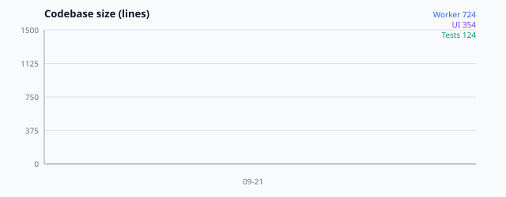
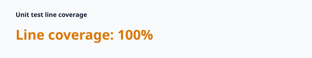

# tsudoi

> Lightweight event roster and check-in software for organizers and attendees.

tsudoi manages venue-based rosters, advance registration, walk-in check-in, QR tickets, participant self-service, and privacy-first organizer communication on Cloudflare.

## Codebase health

CI records Worker, UI, and test line counts on every push to `main`. Dashboard data and charts are committed in [`stats/`](stats/).




Snapshot: [`stats/stats.md`](stats/stats.md)

---

## Current implementation

- Multi-tenant organizations, events, venues, and role-scoped API tokens
- Configurable registration fields and roster data model
- Individual ticket tokens and atomic duplicate-safe check-in
- Attendee Passkey registration and session issuance
- E2EE message ciphertext, key-envelope, and encrypted attachment storage boundaries

See the full product and technical requirements in [`docs/specification.md`](docs/specification.md).

## Configuration and deployment

`wrangler.jsonc` is a public template. It contains no account-specific resource IDs or production domains. The default environment is intended for local development and the Deploy to Cloudflare button; `staging` and `production` are named environments with separate resource names.

Before deploying `staging` or `production`, replace the `example.com` hostnames and verified sender address in the corresponding environment. The `RP_ID` must be the hostname used by `APP_ORIGIN`. Configure a custom domain in the Cloudflare dashboard, or add a `routes` entry to your private deployment configuration.

Resource IDs are intentionally omitted. Wrangler/Deploy to Cloudflare can provision D1, R2, KV, and Queue resources from their names. If you bind existing resources instead, add their IDs in a private environment-specific config and never commit account-specific values or secrets.

```bash
# Local
npm run db:migrate:local
npm run dev

# Deploy after configuring the selected environment
npm run deploy:staging
npm run db:migrate:staging
npm run deploy:production
npm run db:migrate:production
```

Apply the remote migration after the first deployment has provisioned the selected D1 database. For a Deploy to Cloudflare button deployment, select or update the build/deploy commands as needed in the generated project.

## Local development

```bash
npm install
npm --prefix web install
npm run db:migrate:local
npm run build
npm run dev
```

Local bindings use Wrangler's local storage. Do not put API tokens, private keys, or other secrets in `wrangler.jsonc`; use Wrangler secrets or ignored `.dev.vars` files instead.

## Health dashboard

```bash
npm run stats:save
```

All dashboard and chart labels are English to match this README.
